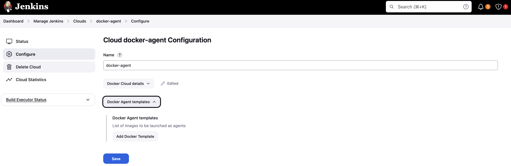

# JENKINS LOCAL SETUP WITH DOCKER AGENT

## TABLE OF CONTENTS

- [JENKINS LOCAL SETUP WITH DOCKER AGENT](#jenkins-local-setup-with-docker-agent)
  - [TABLE OF CONTENTS](#table-of-contents)
    - [Prerequisites](#prerequisites)
    - [Implementaion](#implementaion)
    - [Jenkins Configuration](#jenkins-configuration)
    - [TLS configuration](#tls-configuration)

### Prerequisites

- Docker
- Docker Compose
- Jenkins Image [Jenkins Docker Image](https://hub.docker.com/r/jenkins/jenkins/tags)
- Jenkins Plugins for Docker Agent
- Docker Image for Jenkins Agent [Jenkins Agent Docker Image](https://hub.docker.com/r/jenkins/agent/tags)

### Implementaion

1. Create a `Dockerfile` for Jenkins Agent with `socat` installed

    ```Dockerfile
    ARG PLATFORM=linux/amd64
    ARG IMAGE_TAG=22.04

    FROM --platform=$PLATFORM ubuntu:$IMAGE_TAG

    RUN apt-get update && apt-get install -y \
        curl \
        git \
        unzip \
        wget \
        socat \
        && rm -rf /var/lib/apt/lists/*

    CMD socat TCP-LISTEN:2375,reuseaddr,fork UNIX-CONNECT:/var/run/docker.sock
    ```

2. Build the Docker Image for Jenkins Agent

    ```bash
    docker buildx build --platform linux/amd64 -t <repository>/<image-name>:<image-tag> .
    ```

3. Push the Docker Image to Docker Hub

    ```bash
    docker push <repository>/<image-name>:<image-tag>
    ```

4. Create docker-agent service in the `docker-compose.yaml` file.

    ```yaml
    version: "3"
    services:
        ...

        docker-agent:
            image: premdocker2022/jenkins-agent-ubuntu-22.04-socat:1.0.0
            container_name: docker-agent
            ports:
                - 2376:2375 # expose port 2376 to connect to docker host
            networks:
                - jenkins-net
            volumes:
                - /var/run/docker.sock:/var/run/docker.sock # mount docker socket to run docker commands
            restart: always
    ```

    NOTE: port 2376 is the default encrypted Docker daemon port. It's used when you want to commnicate with the Docker daemon over a network with encryption (TLS).

5. Start the Jenkins and Docker Agent services

    ```bash
    docker-compose up -d
    ```

### Jenkins Configuration

1. Configure Jenkins to use the Docker Agent by adding the Docker Plugin in the Jenkins plugin.

    

    

    

    When finished restart the Jenkins service, Then check the Jenkins Node Configuration to add the Docker Agent at `Manage Jenkins -> Clouds -> New cloud` the `Docker` type will show up.

    ```bash
    docker-compose restart
    ```

    

    

2. Create Docker as New Cloud in Jenkins

    - Go to `Manage Jenkins -> Nodes and Clouds and New cloud`

    
    

3. Configure Docker Agent details in Jenkins

    - Go to `Manage Jenkins -> Nodes and Clouds` Select the **docker-agent** in the Clouds console and configure the Docker Agent.

    ```bash
    docker-compose ps
    ```

    - Get the IP Address of the Docker Agent container and add it to the Docker Agent configuration.

    ```bash
    docker inspect -f '{{range .NetworkSettings.Networks}}{{.IPAddress}}{{end}}' docker-agent
    ```

    

    

    Don't forget to enabled the Docker Agent and test the connection.
    It will show ther version and API version if the connection is successful. Then save the configuration.

4. Configure the Docker Agent template in Jenkins

    - Go to `Manage Jenkins -> Nodes and Clouds` Select the **docker-agent** in the Clouds console and configure the Docker Agent template.

    

    - Add the Docker Agent template with the Docker Image and Label.

    

    - Save the configuration.

    I have used the `jenkins/agent:4.10-1-jdk11` image for the Docker agent.

    Don't forget to enable the Docker Agent template and keep the **Insance Capacity** to low if you don't want to break your system.

5. Create a Jenkins FreeStyle pipeline to use the Docker Agent.

    - Create a new Jenkins FreeStyle pipeline and add the Docker Agent label in the pipeline configuration.

    
    
    

6. Configure the Jenkins job to use the Docker Agent.

    - Add the Docker Agent label in the pipeline configuration.

    

    - Add build steps to execute the commands in the Docker Agent.

    

    - Add the `Post-build Actions` to work after the build execution finished. Then save the configuration.

    

7. Build the Jenkins job and check the Console logs.

    

    

    

8. Verify the Jenkins job run on the Docker Agent.

    - Modify the build step a bit.

    

    - Check build histories and Console logs.

    

    - Build the Jenkins job again and check the Console logs.

    

9. Check the Cloud Statistics in Jenkins.

    - Go to `Dashboard -> Cloud Statistics` or `Manage Jenkins -> Nodes and Clouds` and select the `docker-agent` check the Cloud statistics.

    

### TLS configuration

Exposing the Docker API without TLS is a security risk. To secure the Docker API, you can enable TLS on the Docker Agent. as it can potentially allow remote code execution if not properly secured. Therefore, It's recommended to secure this communication using TLS if you are planning to expose the Docker API over TCP. See the enabled TLS configuration [here](./certificates.md).
